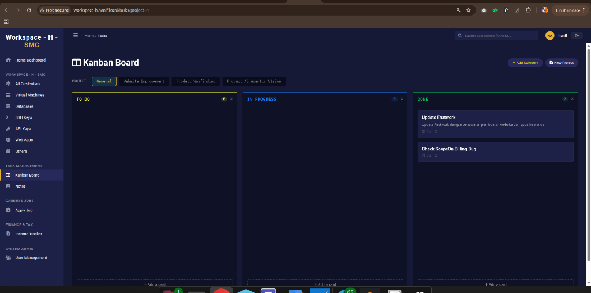

# Workspace - H - SMC



Workspace - H - SMC is a secure, private dashboard application for managing credentials, tasks, and notes with an elegant dark-themed UI. Built with CodeIgniter 3.

## Features
- **Credential Vault**: Securely store and manage sensitive information, SSH keys, database credentials, etc.
- **Kanban Board**: Manage tasks and projects efficiently.
- **Notes (Notion Clone)**: Block-based rich text editor with auto-save, custom icons, and cover images.
- **IT Tender Crawler**: Fetch latest e-procurement tenders automatically.
- **Financial Tracking**: Track project revenues, multi-currency incomes, and automatic tax calculations.
- **Job Application Kit**: Dynamic CV repository with dual-language support, rich text editor (Quill.js), copy-to-clipboard functionality, and ATS-friendly PDF exports.
- **User Management**: Role-Based Access Control (RBAC) with secure password hashing for system administrators and standard users.
- **Global Search**: Command Bar (`Ctrl+K`) for instant navigation across credentials, tasks, and notes.

## Requirements
- PHP 7.4 or newer (with PDO, MySQLi, cURL extensions)
- MySQL / MariaDB (utf8mb4 support recommended)
- Apache / Nginx (with `mod_rewrite` enabled)

---

## Installation Guide (XAMPP - Windows/Mac)

1. **Download & Extract**
   Extract the Workspace-H folder into your XAMPP `htdocs` directory (e.g., `C:\xampp\htdocs\workspace-h`).

2. **Database Setup**
   - Open XAMPP Control Panel and start **Apache** and **MySQL**.
   - Go to `http://localhost/phpmyadmin`.
   - Create a new database named `workspace-h` (Collation: `utf8mb4_unicode_ci`).
   - Import the database structure from `database_export/workspace-h_structure.sql`.

3. **Configure the App**
   - Open `application/config/database.php`.
   - Set the database credentials:
     ```php
     'hostname' => '127.0.0.1',
     'username' => 'root', // default XAMPP user
     'password' => '',     // leave blank for default XAMPP
     'database' => 'workspace-h',
     ```
   - Open `application/config/config.php` and set your `base_url`:
     ```php
     $config['base_url'] = 'http://localhost/workspace-h/';
     ```

4. **Run the App**
   Open your browser and navigate to `http://localhost/workspace-h`.

---

## Installation Guide (Ubuntu Linux)

1. **Install Prerequisites**
   Update your package manager and install Apache, MySQL, and PHP:
   ```bash
   sudo apt update
   sudo apt install apache2 mysql-server php php-mysql php-curl libapache2-mod-php
   ```

2. **Database Setup**
   - Log into MySQL:
     ```bash
     sudo mysql -u root -p
     ```
   - Create the database and user:
     ```sql
     CREATE DATABASE `workspace-h` CHARACTER SET utf8mb4 COLLATE utf8mb4_unicode_ci;
     CREATE USER 'secretuser'@'localhost' IDENTIFIED BY 'your_password';
     GRANT ALL PRIVILEGES ON `workspace-h`.* TO 'secretuser'@'localhost';
     FLUSH PRIVILEGES;
     EXIT;
     ```
   - Import the database structure:
     ```bash
     mysql -u secretuser -p workspace-h < /path/to/workspace-h/database_export/workspace-h_structure.sql
     ```

3. **Deploy the App**
   - Move the Workspace-H folder to `/var/www/html/workspace-h`.
   - Give ownership to the web server:
     ```bash
     sudo chown -R www-data:www-data /var/www/html/workspace-h
     sudo chmod -R 755 /var/www/html/workspace-h
     ```

4. **Enable mod_rewrite**
   - Enable the Apache rewrite module:
     ```bash
     sudo a2enmod rewrite
     ```
   - Allow `.htaccess` overrides by editing `/etc/apache2/apache2.conf`. Find the `<Directory /var/www/>` block and change `AllowOverride None` to `AllowOverride All`:
     ```apache
     <Directory /var/www/html>
         AllowOverride All
     </Directory>
     ```
   - Restart Apache:
     ```bash
     sudo systemctl restart apache2
     ```

5. **Configure the App**
   - Edit `application/config/database.php` with the credentials you created.
   - Edit `application/config/config.php` to set your `$config['base_url']` (e.g., `http://your-server-ip/workspace-h/`).

6. **Run the App**
   Open your browser and navigate to your server's IP address or domain: `http://your-server-ip/workspace-h`.

---

## License
Private / Proprietary.
